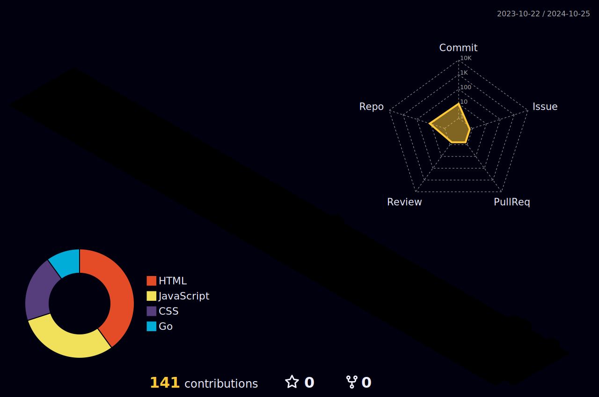

<h1 align="center">𝐇𝐞𝐥𝐥𝐨, 𝐟𝐞𝐥𝐥𝐨𝐰 <𝚌𝚘𝚍𝚎𝚛𝚜></𝚌𝚘𝚍𝚎𝚛𝚜>!  
 
<picture>
  <source media="(prefers-color-scheme: dark)" srcset="https://raw.githubusercontent.com/chfychin/chfychin//output/github-contribution-grid-snake-dark.svg">
  <source media="(prefers-color-scheme: light)" srcset="https://raw.githubusercontent.com/chfychin/chfychin/output/github-contribution-grid-snake.svg">
  
</picture>

## 📲 网站运营

| Icon         | Name             | Link                                               |
|--------------|------------------|----------------------------------------------------|
| 🏠 Home      | 个人主页         | [https://home.chfychin.cn/](https://home.chfychin.cn/)  |
| 🪄 Blog      | 个人博客         | [https://chfychin.cn/](https://chfychin.cn/) |
| 🪄 Blog      | 个人博客         | [https://blog.chfychin.cn/](https://blog.chfychin.cn/) |
| 🎨 Design    | 封面设计         | [https://minicover.chfychin.cn/](https://minicover.chfychin.cn/) |

📕 &nbsp;**Latest Blog Posts**
<!-- BLOG-POST-LIST:START -->

<!-- BLOG-POST-LIST:END -->

                         

                            

## 🚀 我的github活动 
---

  

